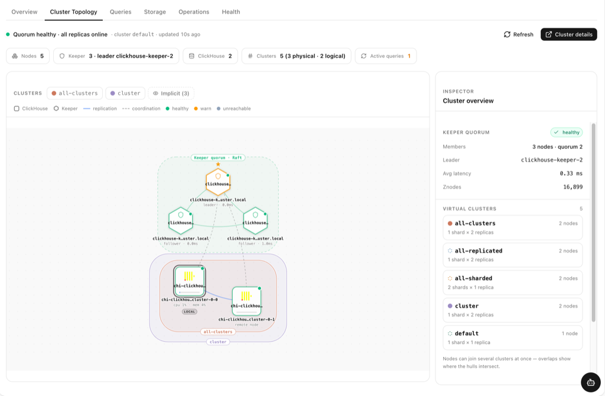
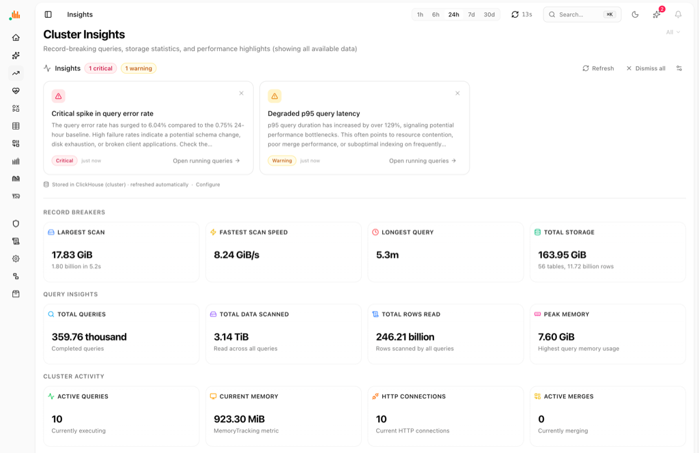
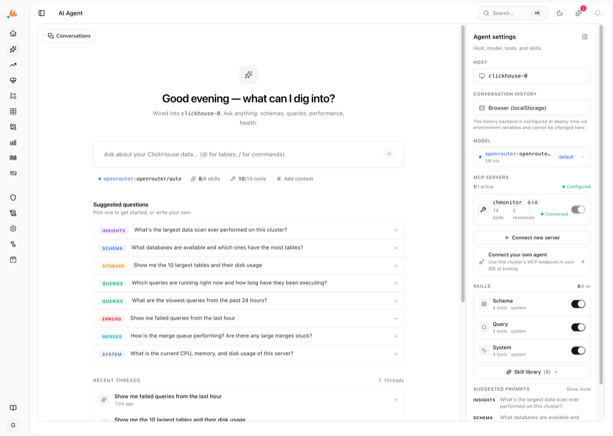
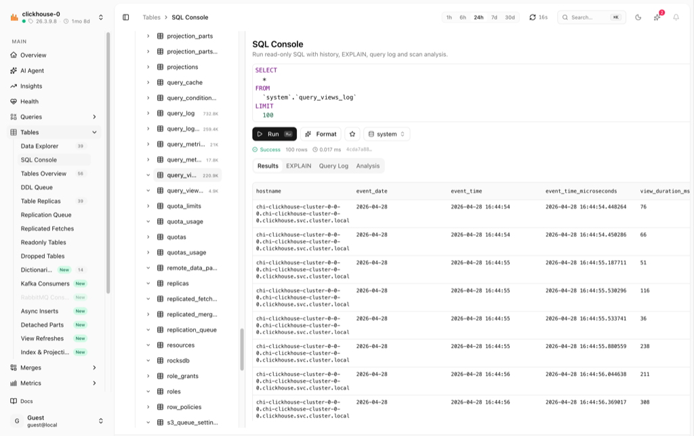
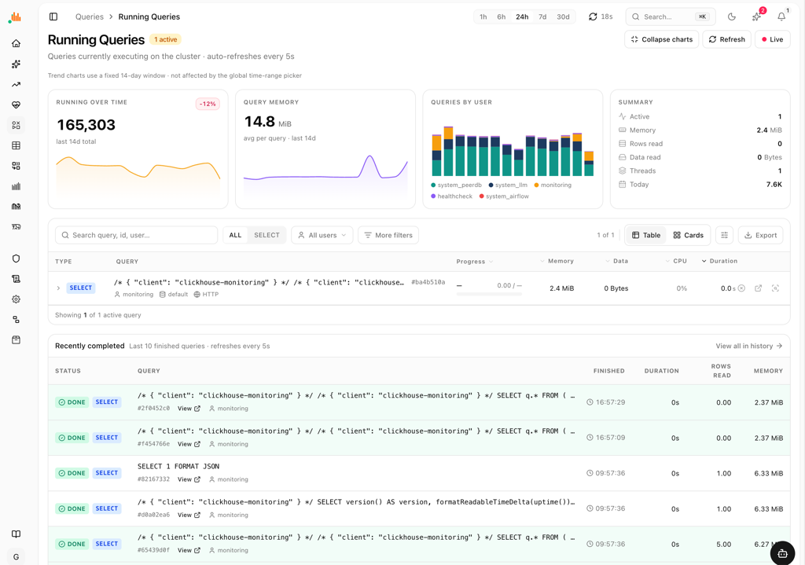
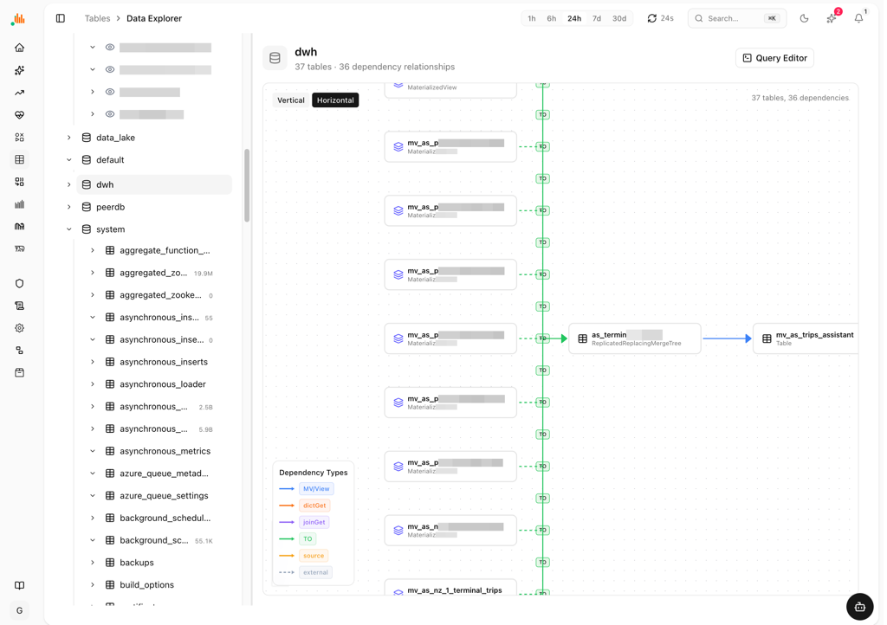
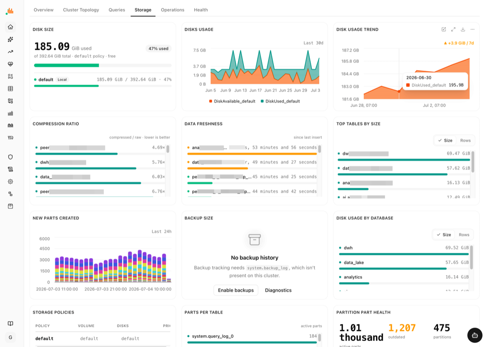
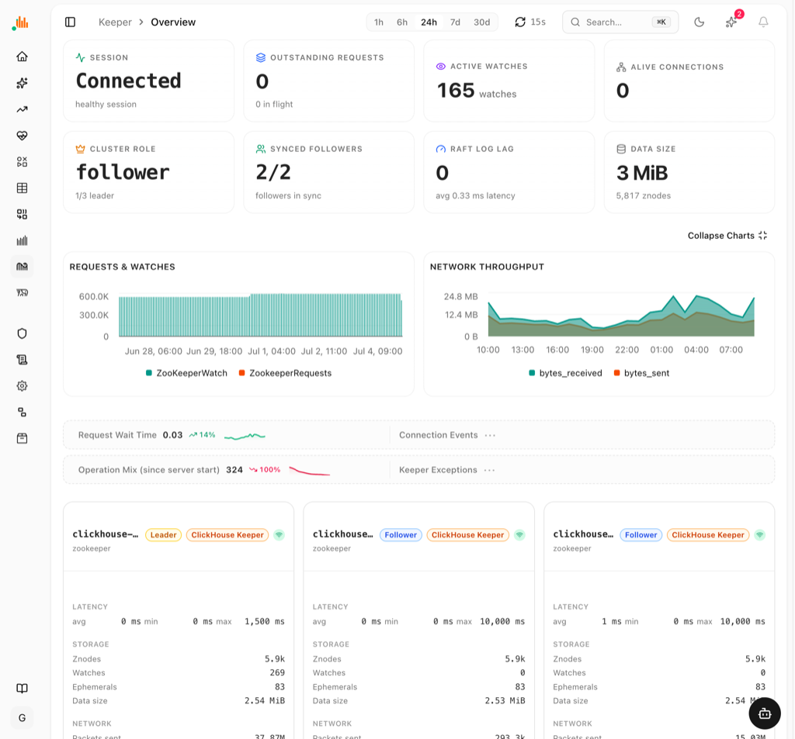

<p align="center">
  <picture>
    <source media="(prefers-color-scheme: dark)" srcset=".github/logo.png">
    
  </picture>
</p>

<h1 align="center">chmonitor</h1>
<p align="center"><strong>The operational advisor for ClickHouse</strong></p>

<p align="center">
  <a href="https://github.com/chmonitor/chmonitor/actions/workflows/ci.yml"></a>
[](https://github.com/chmonitor/chmonitor/stargazers)
[](https://github.com/chmonitor/chmonitor/releases)
[](https://github.com/chmonitor/chmonitor/pkgs/container/chmonitor)
[](LICENSE)

**chmonitor is an operational advisor for ClickHouse** — not just a metrics viewer. It reads `system.*` and recommends projections, skip indexes, partition keys, PREWHERE rewrites, and materialized views (it *recommends*, and never auto-applies DDL), on top of the real-time query/cluster/replication monitoring you'd expect. Managed-ClickHouse AI tools stay locked to their own Cloud; chmonitor works the same way on Docker, Kubernetes, bare metal, or ClickHouse Cloud — self-host it free (GPL-3.0) or use the hosted [Cloud](#self-hosted-oss-vs-cloud-saas), same codebase either way.

<p align="center">
  <a href="https://dash.chmonitor.dev/?ref=github"><strong>Live demo</strong></a> ·
  <a href="https://chmonitor.dev/?ref=github">chmonitor.dev</a> ·
  <a href="https://docs.chmonitor.dev">Docs</a> ·
  <a href="#quick-start">Quick start</a> ·
  <a href="#screenshots">Screenshots</a>
</p>

<picture>
  <source media="(prefers-color-scheme: dark)" srcset=".github/screenshots/overview-dark-with-bg.jpeg">
  
</picture>

> **Upgrading from v0.2?** v0.3 rebuilds the app on TanStack Start. ClickHouse
> connection vars are unchanged; browser vars move from `NEXT_PUBLIC_*` to
> `VITE_*` (old names still work as a fallback). See
> **[Upgrading to v0.3](#upgrading-to-v03)** below or the full
> [Migrate to v0.3](https://docs.chmonitor.dev/reference/migrating/v0-3) guide.

## Features

| Monitoring | AI & extensibility |
|---|---|
| **Query Monitoring** — running queries, history, resources (memory, parts read, file_open), expensive/slow/failed queries, query profiler | **AI Advisor** — projection, skip-index, partition-key, PREWHERE and materialized-view recommendations from `system.*` and EXPLAIN — recommend-only, never auto-applies DDL |
| **Cluster Overview** — memory/CPU, distributed queue, global & MergeTree settings, metrics, asynchronous metrics | **AI Agent** — built-in chat for natural-language questions against your ClickHouse cluster |
| **Data Explorer** — interactive database tree, fast tab switching, column-level detail, projections, dictionaries | **MCP Server** — Model Context Protocol endpoint for AI tool integration (Claude, Cursor, etc.) |
| **Table Analytics** — size, row count, compression, part sizes, detached parts, readonly tables, view refreshes | **Rust CLI** — standalone terminal/TUI monitoring, plus a zero-signup `chm diagnose` that scores a cluster's health directly from ClickHouse ([docs](https://docs.chmonitor.dev/guide/guides/diagnostics-cli)) |
| **Visualization** — 30+ metric charts for queries, resources, merges, performance and system health | **Security & Access** — users, roles, security settings |
| **Merge & Replication** — merge operations, merge performance, replication queue, replicas | **Developer Tools** — Zookeeper explorer, query EXPLAIN, query kill, distributed DDL queue, mutations |
| **Multi-Host Support** — monitor multiple ClickHouse instances from a single dashboard | |

## Self-hosted (OSS) vs Cloud (SaaS)

Same codebase, same features — the only difference is who runs it. See
[Editions](docs/content/operate/advanced/editions.mdx) for the open-core feature gates.

| | Self-hosted (OSS) | Cloud ([dash.chmonitor.dev](https://dash.chmonitor.dev/?ref=github)) |
|---|---|---|
| Cost | Free forever, GPL-3.0 | Free tier, then Pro $29/mo, Max $99/mo, Enterprise custom |
| Runs on | Your infra — Docker, Kubernetes, bare metal, Cloudflare Workers | Hosted by us on Cloudflare's global edge |
| ClickHouse hosts | Unlimited | 1 (Free) · 3 (Pro) · 10 (Max) · unlimited (Enterprise) |
| Setup | `docker run` one-liner below | Sign up — no install |
| Try without an account | — | Public read-only demo cluster |

## Quick start

One container, pointed at any reachable ClickHouse (OSS, Altinity, or ClickHouse Cloud):

```bash
docker run -d --name chmonitor -p 3000:3000 \
  -e CLICKHOUSE_HOST=https://clickhouse.example.com:8443 \
  -e CLICKHOUSE_USER=default \
  -e CLICKHOUSE_PASSWORD=change-me \
  ghcr.io/chmonitor/chmonitor:latest
```

Open **<http://localhost:3000>**. Pin a release tag instead of `latest` for production.

> Just want to look first? The live demo is at **[dash.chmonitor.dev](https://dash.chmonitor.dev/?ref=github)** — no setup required.
> Other targets (Cloudflare Workers, one-click Railway/Render/Fly, Kubernetes) are under [Deployment](#deployment).

## Deployment

To self-host, run it next to your ClickHouse with the same `CLICKHOUSE_*`
connection vars on any of these targets:

- **[Docker](#docker)** — one `docker run`; the fastest path to a live dashboard.
- **[Cloudflare Workers](#cloudflare-workers)** — global edge deploy (how the
  demo at [dash.chmonitor.dev](https://dash.chmonitor.dev/?ref=github) runs).
- **[One-click templates](docs/content/operate/deploy/one-click.mdx)** — Railway, Render, Fly.io.
- **[Kubernetes (Helm)](https://docs.chmonitor.dev/operate/deploy/k8s)** — for clusters.

Prefer to look before you install? Try the live demo above — no setup required.

### Cloudflare Workers

This project supports deployment to Cloudflare Workers with static site generation and API routes.

**Prerequisites:**
- Node.js 18+ and pnpm (bun is still used internally as the test runner and for `.ts` scripts)
- Cloudflare Workers account
- Wrangler CLI: `npm install -g wrangler`

**Setup:**

1. Clone and install dependencies:
```bash
git clone https://github.com/chmonitor/chmonitor.git
cd chmonitor
pnpm install
```

2. Configure environment variables in `.env.local`:
```bash
CLICKHOUSE_HOST=https://your-clickhouse-host.com
CLICKHOUSE_USER=default
CLICKHOUSE_PASSWORD=yourpassword
CLICKHOUSE_TZ=UTC
```

Optional API-key protection for `/api/v1/*` routes:

```bash
CHM_API_KEY_SECRET=your-signing-secret
```

Optional Clerk UI/session support (set at build time; `NEXT_PUBLIC_*` is the v0.2 fallback):

```bash
CHM_AUTH_PROVIDER=clerk
VITE_AUTH_PROVIDER=clerk
VITE_CLERK_PUBLISHABLE_KEY=pk_live_your_key
CLERK_SECRET_KEY=sk_live_your_key
```

Feature permissions default to enabled and public. Add sparse overrides when a
deployment should hide or protect a feature:

```toml
# /etc/clickhouse-monitor/config.toml
[features.agent]
access = "authenticated"

[features.metrics]
enabled = false
```

`access = "guest"` is accepted as an alias for `access = "public"`.

```bash
CHM_CONFIG_FILE=/etc/clickhouse-monitor/config.toml
# or env-only:
CHM_FEATURE_AGENT_ACCESS=authenticated
CHM_DISABLED_FEATURES=settings,metrics
```

Leave auth provider env unset or set it to `none` for self-hosted deployments
without auth.

3. Deploy to Cloudflare Workers:
```bash
# Set CLOUDFLARE_API_TOKEN in .env.production.local or export it
# OR use OAuth: npx wrangler login

# Unified deploy (config, build, deploy, cache — same as CI)
pnpm run cf:deploy
```

**Manual Deployment Steps:**
```bash
# Step by step (same as CI)
pnpm run cf:config        # Set secrets from .env.production.local
cd apps/dashboard
pnpm run build            # Vite build → native Workers bundle (+ tsc --noEmit)
wrangler deploy --minify
```

**Important Notes:**
- Built with **Vite** + `@cloudflare/vite-plugin` into a **native Workers bundle** — no OpenNext, no KV/R2/D1 cache-population step
- **TanStack Start** + React 19 (the v0.2 Next.js app was retired in v0.3)
- Static shell is pre-rendered at build time; data is fetched client-side for edge CDN caching
- API routes run on Workers using the Fetch API
- Supports multi-host monitoring with query parameter routing (`?host=0`)

### Docker

```bash
docker run -d \
  -p 3000:3000 \
  -e CLICKHOUSE_HOST=https://your-clickhouse-host.com \
  -e CLICKHOUSE_USER=default \
  -e CLICKHOUSE_PASSWORD=yourpassword \
  ghcr.io/chmonitor/chmonitor:latest
```

### Releases

Tagged releases are built by GitHub Actions from tags matching `v*`. The release page includes:

- Docker images published to `ghcr.io/chmonitor/chmonitor` with the release version tag
- a Node.js standalone archive (`*-standalone.tar.gz`, the Nitro node-server output) for self-hosted Node deployments
- a Cloudflare Workers archive (`*-cloudflare.tar.gz`) for manual inspection or deployment
- generated release notes with CLI command usage, Docker tags, deployment steps, and checksums

For repeatable Docker deploys, prefer the versioned image tag from the release page instead of `latest`.

## Upgrading to v0.3

v0.3 rebuilds the dashboard on **TanStack Start**. Features, routes, and
ClickHouse setup carry over unchanged. The only env change is the browser
variable prefix, and the old names keep working:

| Concern | v0.2 (Next.js) | v0.3 (TanStack Start) |
|---|---|---|
| Browser var prefix | `NEXT_PUBLIC_*` | `VITE_*` _(old names still work)_ |
| Auth provider (client) | `NEXT_PUBLIC_AUTH_PROVIDER` | `VITE_AUTH_PROVIDER` |
| Clerk key (client) | `NEXT_PUBLIC_CLERK_PUBLISHABLE_KEY` | `VITE_CLERK_PUBLISHABLE_KEY` |
| Auth provider (server) | derived from client var | `CHM_AUTH_PROVIDER` (`none\|clerk\|proxy`) |
| Docker entrypoint | `node server.js` | `node server/index.mjs` |
| ClickHouse vars | `CLICKHOUSE_HOST/USER/PASSWORD/NAME` | **unchanged** |

`VITE_*` vars are **build-time inlined** — set them when building the image/Worker,
not only at runtime. Full per-platform steps:
[Migrate to v0.3](https://docs.chmonitor.dev/reference/migrating/v0-3).

### Migrate your config with an AI assistant

Paste your current configuration (`.env`, `docker-compose.yml`, Helm
`values.yaml`, or a k8s manifest) into any AI assistant with the prompt below.
It applies the v0.3 rename rules and returns the migrated config plus a summary
of what changed. This same prompt ships in every breaking-change GitHub Release
and is kept in sync from [`.github/release-migration-prompt.md`](.github/release-migration-prompt.md).

```text
You are migrating a chmonitor deployment from v0.2 (Next.js) to v0.3 (TanStack Start).
Here is my current environment (.env / docker-compose / wrangler / k8s manifest):

<PASTE YOUR ENV HERE>

Rewrite it for v0.3 applying EXACTLY these rules, and output the migrated config
plus a short list of what you changed:

1. Rename every client var prefix NEXT_PUBLIC_ -> VITE_. Specifically:
   NEXT_PUBLIC_AUTH_PROVIDER          -> VITE_AUTH_PROVIDER
   NEXT_PUBLIC_CLERK_PUBLISHABLE_KEY  -> VITE_CLERK_PUBLISHABLE_KEY
   NEXT_PUBLIC_FEATURE_CONVERSATION_DB-> VITE_FEATURE_CONVERSATION_DB
   (any other NEXT_PUBLIC_X -> VITE_X). The old names still work as a fallback.
2. Add server-side auth var CHM_AUTH_PROVIDER (none|clerk|proxy) mirroring the
   client provider. It is authoritative on the server; keep VITE_AUTH_PROVIDER too.
3. Do NOT rename server vars: CLICKHOUSE_HOST, CLICKHOUSE_USER, CLICKHOUSE_PASSWORD,
   CLICKHOUSE_NAME, CLICKHOUSE_MAX_EXECUTION_TIME, CLERK_SECRET_KEY, *_API_KEY — keep as-is.
4. VITE_* vars are build-time inlined: ensure they are present at image/Worker BUILD
   time (Docker build-args or CI build env), not only at container runtime.
5. If this is a Docker deployment, change the container start command from
   `node server.js` to `node server/index.mjs`. Port 3000 and the /api/healthz
   healthcheck are unchanged.
6. Flag anything that has no v0.3 equivalent instead of silently dropping it.
```

## Documentation

- **[docs/](/docs)** - Documentation source in this repository (see below for the live site)
- **llms.txt** - AI agent discovery file for automated code understanding
- https://zread.ai/chmonitor/chmonitor _(AI Generated)_
- https://docs.chmonitor.dev
  - [Getting Started](https://docs.chmonitor.dev/guide/getting-started)
    - [Local Development](https://docs.chmonitor.dev/guide/getting-started/local)
    - [User Role and Profile](https://docs.chmonitor.dev/guide/getting-started/clickhouse-requirements)
    - [Enable System Tables](https://docs.chmonitor.dev/guide/getting-started/clickhouse-enable-system-tables)
  - [Deployments](https://docs.chmonitor.dev/operate/deploy)
    - [Vercel](https://docs.chmonitor.dev/operate/deploy/vercel) _(legacy v0.2)_
    - [Docker](https://docs.chmonitor.dev/operate/deploy/docker)
    - [Kubernetes Helm Chart](https://docs.chmonitor.dev/operate/deploy/k8s)
    - [One-Click Deploy](docs/content/operate/deploy/one-click.mdx) — Railway / Render / Fly.io community templates
  - Advanced
    - [Telemetry](docs/content/operate/advanced/telemetry.mdx) — opt-in, privacy-first usage metrics (off by default)
    - [Editions](docs/content/operate/advanced/editions.mdx) — open-core model: GPL-3.0 community is free forever; enterprise features gated by `CHM_EDITION`
  - [Reference](https://docs.chmonitor.dev/reference)
    - [Platform Support Matrix](docs/content/reference/support-matrix.mdx) — ClickHouse versions and distributions (supported / best-effort / untested)
    - [Connection Presets](docs/content/reference/connection-presets.mdx) — least-privilege read-only user setup for ClickHouse OSS, Altinity, and Cloud
    - [Contributing a config / check](docs/content/reference/catalog-contributing.mdx) — how to add a declarative monitoring check to the catalog
    - [MCP Clients](docs/content/reference/mcp-clients.mdx) — connect Claude Desktop, Cursor, or any MCP client
    - [Grafana Bridge](docs/content/reference/grafana-bridge.mdx) — read chmonitor's ClickHouse from Grafana (community recipe)

### AI Agent Access

**llms.txt** — standardized file that helps AI coding agents discover and understand the codebase structure. Access at `https://your-domain.com/llms.txt` or `/llms.txt` in local development.

**MCP Server** — exposes a Model Context Protocol endpoint at `/api/mcp` for AI tools to query your ClickHouse cluster directly (read-only). One-command install:

```bash
# Claude Code
claude mcp add --transport http clickhouse-monitor https://your-chmonitor.example.com/api/mcp \
  --header "Authorization: Bearer chm_your_api_key"
```

```json
// Claude Desktop (claude_desktop_config.json) or Cursor (.cursor/mcp.json)
{
  "mcpServers": {
    "clickhouse-monitor": {
      "url": "https://your-chmonitor.example.com/api/mcp",
      "headers": { "Authorization": "Bearer chm_your_api_key" }
    }
  }
}
```

Omit the `Authorization` header/flag for an unauthenticated local instance. Full client
walkthroughs (Claude Desktop, Claude Code, Cursor, any MCP client) and auth setup:
[docs/content/reference/mcp-clients.mdx](docs/content/reference/mcp-clients.mdx) ·
[docs/knowledge/mcp-server.md](docs/knowledge/mcp-server.md).

**Knowledge Graph** — developer-facing notes in `docs/knowledge/` with decisions, conventions, and architecture docs. See [docs/knowledge/README.md](docs/knowledge/README.md) for the index.

## Screenshots

<picture>
  <source media="(prefers-color-scheme: dark)" srcset=".github/screenshots/overview-dark-with-bg.jpeg">
  
</picture>

<picture>
  <source media="(prefers-color-scheme: dark)" srcset=".github/screenshots/overview-with-charts-dark-with-bg.jpeg">
  
</picture>

<picture>
  <source media="(prefers-color-scheme: dark)" srcset=".github/screenshots/cluster-topology-dark.png">
  
</picture>

<picture>
  <source media="(prefers-color-scheme: dark)" srcset=".github/screenshots/cluster-insights-dark.png">
  
</picture>

<picture>
  <source media="(prefers-color-scheme: dark)" srcset=".github/screenshots/chmonitor-health-dark.png">
  
</picture>

<picture>
  <source media="(prefers-color-scheme: dark)" srcset=".github/screenshots/ai-agent-dark.png">
  
</picture>

<picture>
  <source media="(prefers-color-scheme: dark)" srcset=".github/screenshots/mcp-server-dark.png">
  
</picture>

<picture>
  <source media="(prefers-color-scheme: dark)" srcset=".github/screenshots/sql-console-dark.png">
  
</picture>



<picture>
  <source media="(prefers-color-scheme: dark)" srcset=".github/screenshots/explain-dark.png">
  
</picture>

<picture>
  <source media="(prefers-color-scheme: dark)" srcset=".github/screenshots/data-explorer-graph-dark.png">
  
</picture>

<picture>
  <source media="(prefers-color-scheme: dark)" srcset=".github/screenshots/storage-dark.png">
  
</picture>



## Feedback and Contributions

Feedback and contributions are welcome! Feel free to open issues or submit pull requests.

## License

See [LICENSE](LICENSE).

---


